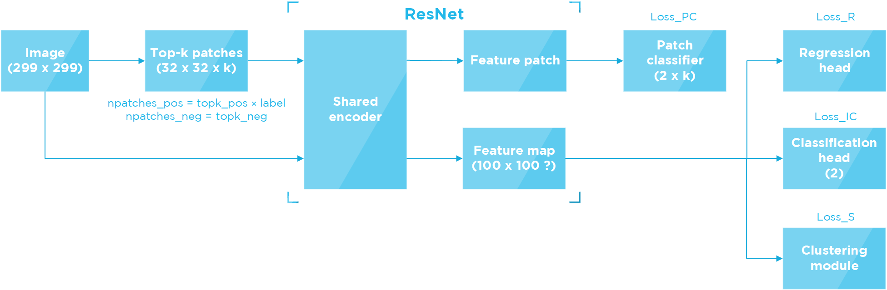

## Semantic Segmentation of Lymphocytes by Multiple Instance Learning

This is a project for **the Lymphocyte Assessment Hackathon** ([LYSTO](https://lysto.grand-challenge.org/)) Challenge.

### Network
